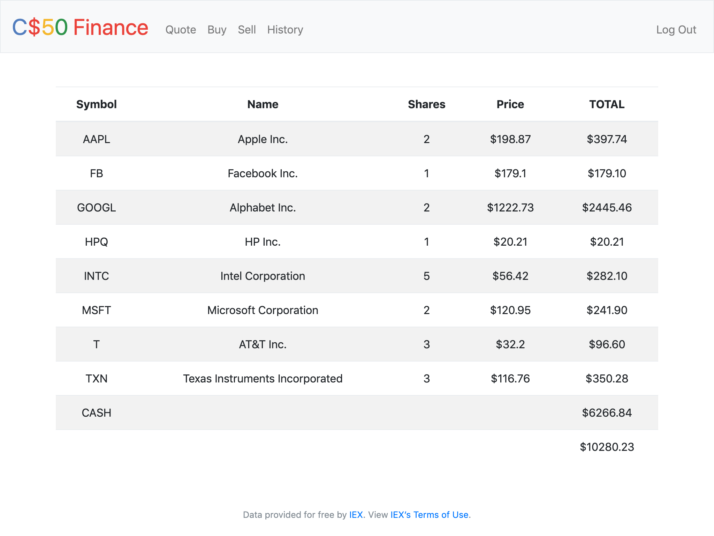

# Finance

A stock-trading website where users can "buy" and "sell" stocks.




## Getting started

### Virtual Environment

For better control over installed packages on a local machine.

```
$ pip install virtualenv
$ virtualenv myenv
$ source myenv/bin/activate
```


### Install requirements

`$ pip install -r requirements.txt`


### Running

`$ python application.py`